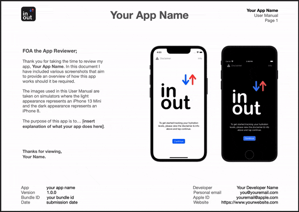
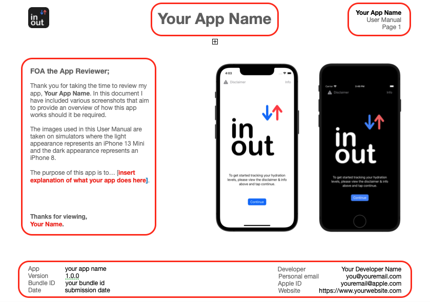

# App Store Tools - Example User Manual
  

  

## Feel free to use this template when submitting to the App Store.
 
You've worked hard on your app and have finally decided to submit it for review over at App Store Connect.
If you want to cover all bases and leave no ambiguity, I'd suggest making a user manaul.
  

I wrote an article about this which can be viewed on [Medium](https://medium.com/@kysodev/why-you-should-write-a-user-manual-when-submitting-to-the-appstore-4932393bf941) and was given the idea for this user manual by [Daniel Pass](https://twitter.com/thatmrdan?s=11&t=rO9FKqs_gGadXj_9c6xApg) (who posts great content and deserves a follow on Twitter).

  

# Template info

* This template was created using Apple's Pages app on Mac and exported as a PDF.
* Images from this template are from my own published App, [inOut Tracker](https://apps.apple.com/us/app/inout-tracker/id1637413709?itscg=30200&itsct=apps_box_promote_link) and are used as an example.

If you wish to use this template, it is free to use, adapting it for your own content accordingly (images/screenshots/content).
   
# How to use

* Open in your preferred PDF reader.
* Change the content to match your App details

Naturally there will be a lot that you need to adjust on this to fit your own needs such as the header and footer as seen below, the content to the left of the screenshots and the actual images/screenshots used. 
  Again, this is just an example and you can of course change the colors, font, text size, layout etc to however you'd like.

